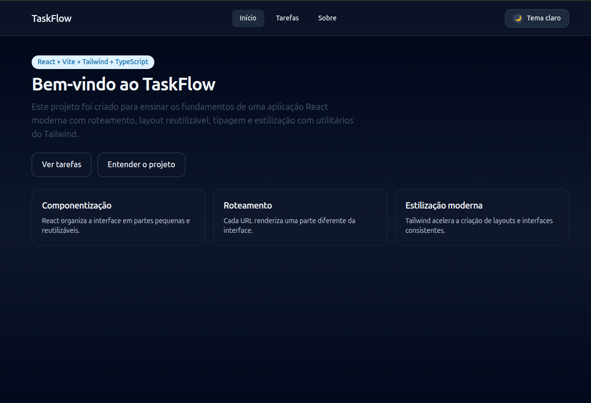
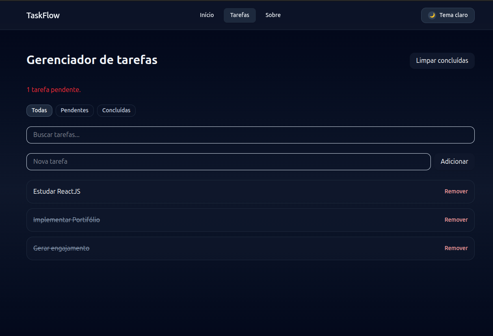
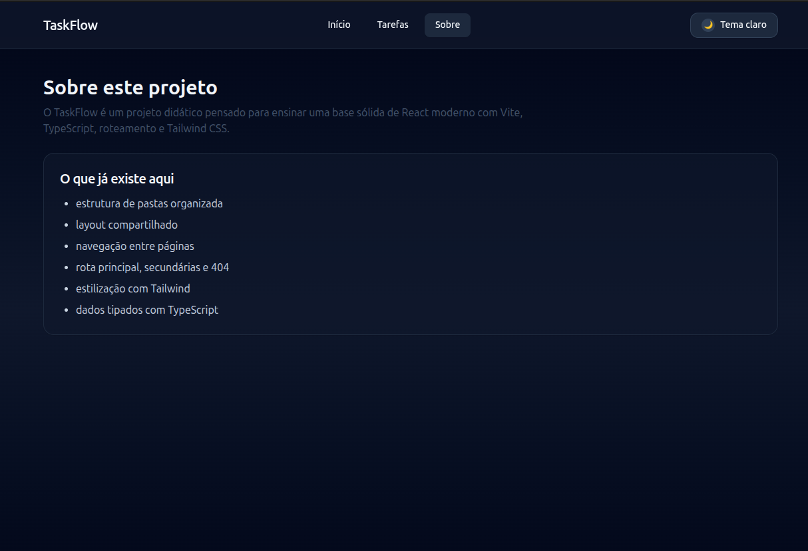
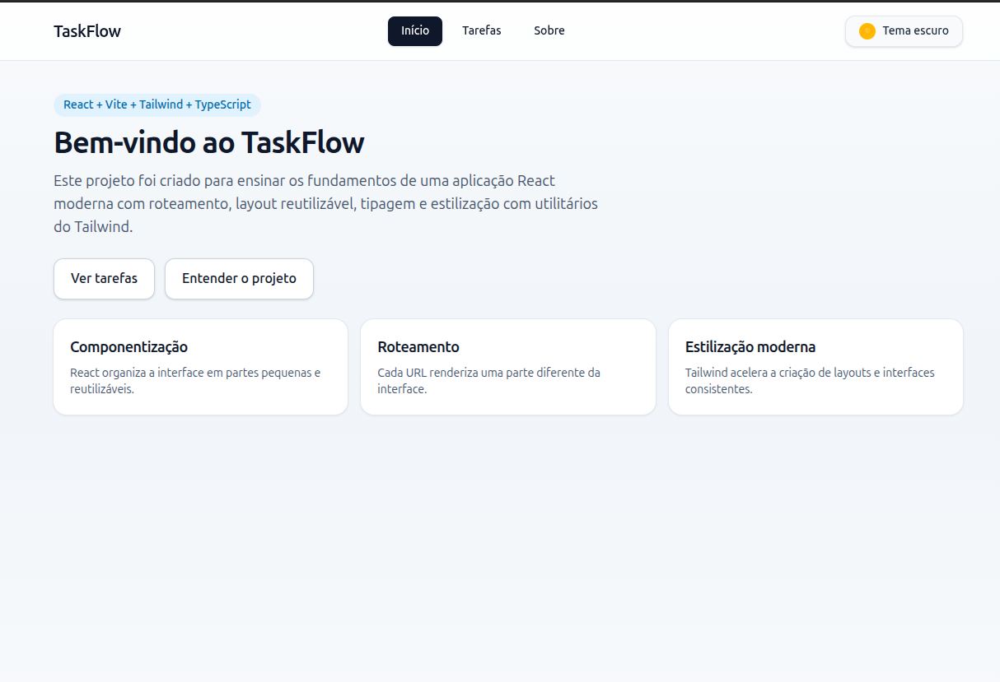
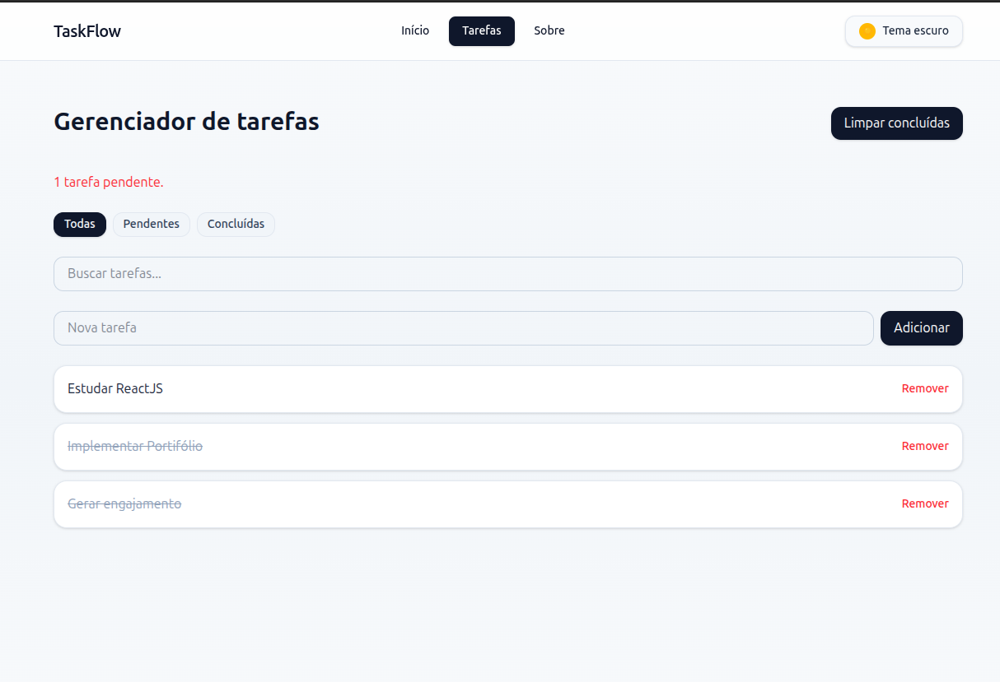
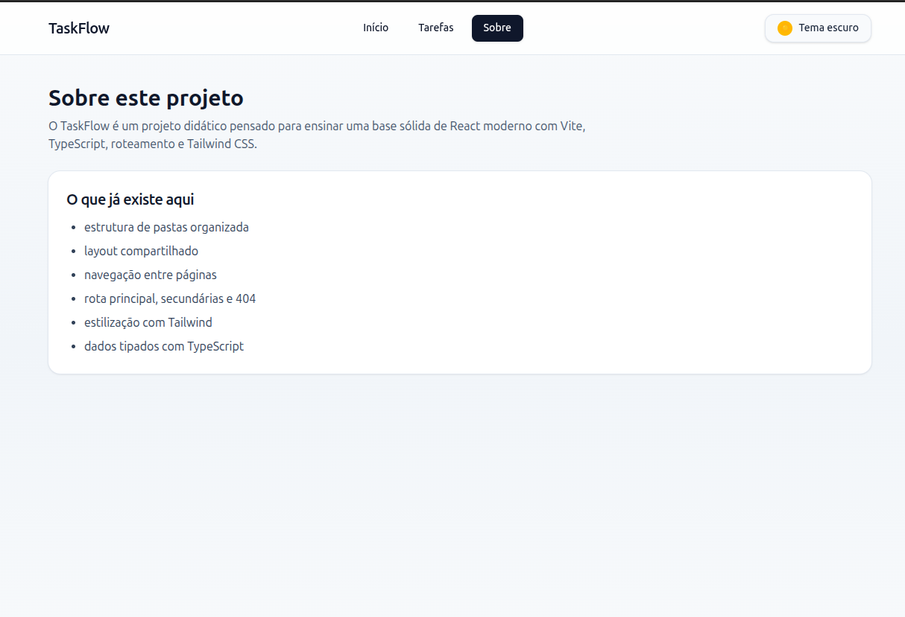

# 🚀 TaskFlow

<div align="center">


**Uma aplicação moderna de gerenciamento de tarefas construída com React, TypeScript e Tailwind CSS**

[](https://react.dev/)
[](https://www.typescriptlang.org/)
[](https://vitejs.dev/)
[](https://tailwindcss.com/)

</div>

---

## 📋 Sobre o Projeto

O **TaskFlow** é uma aplicação web moderna e responsiva para gerenciamento de tarefas, desenvolvida como projeto didático para demonstrar as melhores práticas de desenvolvimento React moderno. A aplicação oferece uma experiência de usuário fluida com tema claro/escuro, interface intuitiva e funcionalidades completas de CRUD.

### 🎯 Objetivo

Este projeto foi criado para ensinar e demonstrar os fundamentos de uma aplicação React moderna, incluindo:
- Roteamento com React Router
- Gerenciamento de estado com Zustand
- Tipagem forte com TypeScript
- Estilização moderna com Tailwind CSS
- Arquitetura escalável e organizada

---

## ✨ Funcionalidades

### 🎨 Interface e Experiência do Usuário
- ✅ **Tema Claro/Escuro** - Alternância suave entre temas com persistência de preferência
- ✅ **Design Responsivo** - Interface adaptável para diferentes tamanhos de tela
- ✅ **UI Moderna** - Interface limpa e profissional com Tailwind CSS
- ✅ **Animações Suaves** - Transições e hovers elegantes

### 📝 Gerenciamento de Tarefas
- ✅ **CRUD Completo** - Criar, ler, atualizar e deletar tarefas
- ✅ **Filtros Inteligentes** - Filtrar por todas, pendentes ou concluídas
- ✅ **Busca em Tempo Real** - Pesquisa instantânea com debounce
- ✅ **Marcação Visual** - Tarefas concluídas com estilo diferenciado
- ✅ **Contador de Pendentes** - Acompanhamento em tempo real
- ✅ **Limpeza Rápida** - Remover todas as tarefas concluídas de uma vez

### 🏗️ Arquitetura e Organização
- ✅ **Estrutura Modular** - Organização por features e responsabilidades
- ✅ **Componentização** - Componentes reutilizáveis e bem estruturados
- ✅ **Roteamento** - Navegação entre páginas com React Router
- ✅ **Persistência Local** - Dados salvos automaticamente no localStorage
- ✅ **TypeScript** - Tipagem completa para maior segurança

---

## 🖼️ Screenshots

### Tema Escuro

#### Página Inicial (Dark Mode)

*Interface inicial com tema escuro mostrando os recursos do projeto*

#### Página de Tarefas (Dark Mode)

*Gerenciador de tarefas com filtros e busca em tema escuro*

#### Página Sobre (Dark Mode)

*Página informativa sobre o projeto em tema escuro*

### Tema Claro

#### Página Inicial (Light Mode)

*Interface inicial com tema claro destacando a modernidade do design*

#### Página de Tarefas (Light Mode)

*Gerenciador de tarefas com interface clara e intuitiva*

#### Página Sobre (Light Mode)

*Página sobre o projeto em tema claro*

---

## 🛠️ Tecnologias Utilizadas

### Core
- **[React 19.2.4](https://react.dev/)** - Biblioteca JavaScript para construção de interfaces
- **[TypeScript 5.9.3](https://www.typescriptlang.org/)** - Superset JavaScript com tipagem estática
- **[Vite 7.3.1](https://vitejs.dev/)** - Build tool moderna e rápida

### Roteamento e Estado
- **[React Router 7.13.1](https://reactrouter.com/)** - Roteamento declarativo para React
- **[Zustand 5.0.12](https://zustand-demo.pmnd.rs/)** - Gerenciamento de estado leve e eficiente

### Estilização
- **[Tailwind CSS 4.2.1](https://tailwindcss.com/)** - Framework CSS utility-first
- **[@tailwindcss/vite](https://tailwindcss.com/docs/installation)** - Plugin oficial para Vite

### Testes
- **[Vitest 4.1.0](https://vitest.dev/)** - Framework de testes rápido
- **[Testing Library](https://testing-library.com/)** - Utilitários para testes de componentes React

### Qualidade de Código
- **[ESLint 9.39.4](https://eslint.org/)** - Linter para JavaScript/TypeScript
- **[TypeScript ESLint](https://typescript-eslint.io/)** - Regras específicas para TypeScript

---

## 📁 Estrutura do Projeto

```
taskflow/
├── public/                 # Arquivos estáticos
├── src/
│   ├── features/          # Funcionalidades organizadas por domínio
│   │   ├── tasks/         # Feature de tarefas
│   │   │   ├── components/    # Componentes específicos
│   │   │   ├── hooks/         # Hooks customizados
│   │   │   ├── reducer/       # Reducers (se aplicável)
│   │   │   ├── selectors/     # Seletores de dados
│   │   │   ├── store/          # Store Zustand
│   │   │   └── types/          # Tipos TypeScript
│   │   └── theme/          # Feature de tema
│   │       └── store/          # Store do tema
│   ├── layouts/          # Layouts compartilhados
│   ├── pages/            # Páginas da aplicação
│   ├── shared/           # Código compartilhado
│   │   └── hooks/            # Hooks compartilhados
│   ├── App.tsx           # Componente raiz
│   ├── main.tsx          # Entry point
│   └── index.css         # Estilos globais
├── package.json
├── tsconfig.json         # Configuração TypeScript
├── vite.config.ts        # Configuração Vite
└── README.md
```

### 🎯 Princípios de Organização

- **Feature-Based Structure** - Código organizado por funcionalidades
- **Separation of Concerns** - Separação clara de responsabilidades
- **Reusability** - Componentes e hooks reutilizáveis
- **Type Safety** - Tipagem completa em todos os níveis

---

## 🚀 Como Executar

### Pré-requisitos

- Node.js 18+ instalado
- npm ou yarn

### Instalação

1. **Clone o repositório**
```bash
git clone https://github.com/seu-usuario/taskflow.git
cd taskflow
```

2. **Instale as dependências**
```bash
npm install
```

3. **Execute em modo de desenvolvimento**
```bash
npm run dev
```

4. **Acesse no navegador**
```
http://localhost:5173
```

### Scripts Disponíveis

```bash
# Desenvolvimento
npm run dev          # Inicia servidor de desenvolvimento

# Build
npm run build        # Gera build de produção

# Preview
npm run preview      # Preview do build de produção

# Qualidade
npm run lint         # Executa ESLint
npm test             # Executa testes com Vitest
```

---

## 💡 Pontos Fortes do Projeto

### 🎨 Design e UX
- **Interface Moderna**: Design limpo e profissional com Tailwind CSS
- **Tema Adaptável**: Suporte completo a tema claro e escuro com persistência
- **Responsividade**: Layout adaptável para desktop, tablet e mobile
- **Feedback Visual**: Animações e transições suaves para melhor UX

### 🏗️ Arquitetura
- **Código Limpo**: Estrutura organizada e fácil de manter
- **Componentização**: Componentes reutilizáveis e bem estruturados
- **Type Safety**: TypeScript em 100% do código para maior segurança
- **Escalabilidade**: Arquitetura preparada para crescimento

### ⚡ Performance
- **Vite**: Build tool ultra-rápida para desenvolvimento e produção
- **React 19**: Utiliza a versão mais recente do React
- **Otimizações**: Memoização e otimizações de renderização
- **Debounce**: Busca otimizada com debounce para melhor performance

### 🔧 Boas Práticas
- **Estado Global**: Gerenciamento eficiente com Zustand
- **Persistência**: Dados salvos automaticamente no localStorage
- **Roteamento**: Navegação declarativa com React Router
- **Testes**: Estrutura preparada para testes unitários e de integração

### 📚 Educacional
- **Documentação**: Código bem documentado e comentado
- **Padrões**: Segue as melhores práticas da comunidade React
- **Aprendizado**: Projeto ideal para entender React moderno

---

## 🎓 Conceitos Demonstrados

Este projeto demonstra na prática:

- ✅ **Hooks do React** - useState, useEffect, useRef, custom hooks
- ✅ **Gerenciamento de Estado** - Zustand para estado global
- ✅ **Roteamento** - React Router para navegação SPA
- ✅ **TypeScript** - Tipagem estática e interfaces
- ✅ **Tailwind CSS** - Estilização utility-first
- ✅ **Persistência** - localStorage para salvar dados
- ✅ **Debounce** - Otimização de busca
- ✅ **Componentização** - Componentes reutilizáveis
- ✅ **Arquitetura** - Estrutura escalável e organizada

---

## 📄 Páginas da Aplicação

### 🏠 Home (`/`)
Página inicial apresentando o projeto, tecnologias utilizadas e recursos principais através de cards informativos.

### 📝 Tarefas (`/tarefas`)
Página principal com gerenciador completo de tarefas:
- Listagem de tarefas
- Filtros (Todas, Pendentes, Concluídas)
- Busca em tempo real
- Adição de novas tarefas
- Remoção de tarefas
- Marcação de conclusão

### ℹ️ Sobre (`/sobre`)
Página informativa sobre o projeto, tecnologias e estrutura existente.

### ❌ 404 (`/*`)
Página de erro personalizada para rotas não encontradas.

---

## 🔮 Melhorias Futuras

- [ ] Drag and drop para reordenar tarefas
- [ ] Categorias e tags para tarefas
- [ ] Data de vencimento e lembretes
- [ ] Sincronização com backend
- [ ] Autenticação de usuários
- [ ] Compartilhamento de tarefas
- [ ] Modo offline com Service Workers
- [ ] PWA completo

---

## 👨‍💻 Desenvolvedor

Desenvolvido com ❤️ para demonstrar habilidades em React moderno e TypeScript.

---

## 📝 Licença

Este projeto é de código aberto e está disponível sob a licença MIT.

---

## 🙏 Agradecimentos

- [React](https://react.dev/) - Biblioteca incrível para construção de UIs
- [Vite](https://vitejs.dev/) - Build tool moderna e rápida
- [Tailwind CSS](https://tailwindcss.com/) - Framework CSS utility-first
- [Zustand](https://zustand-demo.pmnd.rs/) - Gerenciamento de estado simples
- [React Router](https://reactrouter.com/) - Roteamento declarativo

---

<div align="center">

**⭐ Se este projeto foi útil, considere dar uma estrela! ⭐**

Feito com React, TypeScript e muito ☕

</div>
